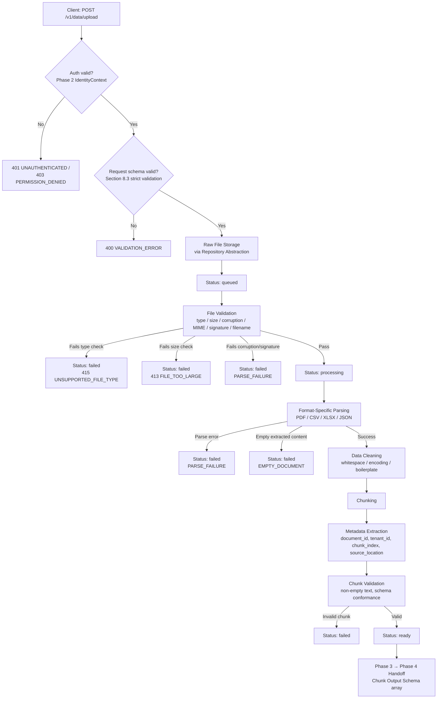

# PHASE_3_INGESTION.md
## Phase 3 — Data Upload & Ingestion

---

# 1. Document Information

| Field | Value |
|---|---|
| Document name | `PHASE_3_INGESTION.md` |
| Project name | Plug-and-Play Agentic RAG Chatbot |
| Phase | Phase 3 — Data Upload & Ingestion |
| Owner | Phase 3 developer(s) / sub-team |
| Version | 1.1 (tracks `TECHNICAL_CONTRACT.md` v1.1; corrects v1.0 audit findings) |
| Status | Draft — Implementation-ready, pending Phase 3-specific TBD resolution |
| Related technical contract | `TECHNICAL_CONTRACT.md`, v1.1 (single source of truth; this document does not override it) |

---

# 2. Purpose

Phase 3 is the entry point through which authorized host-application data (PDF, CSV, Excel, JSON) becomes usable by the rest of the Agentic RAG pipeline. It receives uploaded files, validates and parses them, cleans and chunks the extracted text, attaches tenant/document metadata, tracks ingestion status, and hands off clean, schema-conformant chunks to Phase 4.

Phase 3 sits between the API/auth layer (Phases 1–2) and the retrieval layer (Phase 4). Every downstream phase depends on Phase 3 producing correct, tenant-isolated, well-formed chunks. This document exists so Phase 3 can be implemented independently, in parallel with other phases, while guaranteeing its inputs and outputs match `TECHNICAL_CONTRACT.md` exactly.

**Performance note:** File ingestion/upload processing is explicitly **outside the query-path latency budget** (contract Section 20.3: "File ingestion/upload processing — outside the query-path budget"). The ~200ms backend target (Section 20) applies to the `/v1/query` path, not to Phase 3.

---

# 3. Scope

### In Scope
- Accepting file uploads via `POST /v1/data/upload`
- File validation (type, size, corruption, MIME/signature, filename safety)
- Parsing PDF, CSV, Excel (`.xlsx`), and JSON into plain text + structural metadata
- Data cleaning (whitespace normalization, encoding fixes, boilerplate removal)
- Chunking extracted text into retrieval-ready pieces
- Metadata extraction and attachment
- Ingestion status lifecycle management (`queued` → `processing` → `ready`/`failed`)
- Storage of raw files and chunk-ready output through an internal repository/abstraction
- Producing the Phase 3 → Phase 4 Chunk Output Schema

### Out of Scope
- Embedding generation (Phase 4)
- Vector search / similarity retrieval (Phase 4)
- Final answer generation or LLM calls (Phase 6)
- Agentic orchestration, tool routing, clarification logic (Phase 5)
- Chatbot UI rendering or upload UX (Phase 8)
- Authentication/session validation and RBAC decisions (Phase 2 — Phase 3 consumes `IdentityContext` only)

---

# 4. Phase 3 Responsibilities

Per contract Sections 5, 6, 11:

1. Data/file upload handling — `multipart/form-data` at `POST /v1/data/upload`
2. File validation — type, size, corruption, MIME type, file signature/magic bytes, filename/path safety
3. PDF parsing — text extraction with page-level structural metadata
4. CSV parsing — row/column extraction with structural metadata
5. Excel (`.xlsx`) parsing — cell/row/column/sheet extraction
6. JSON parsing — native parsing, including flattening/summarization of nested structures
7. Data cleaning — whitespace normalization, encoding fixes, boilerplate removal
8. Chunking — splitting cleaned text into retrieval-sized chunks
9. Metadata extraction — attaching `document_id`, `tenant_id`, `chunk_id`, `chunk_index`, `source_location`, etc.
10. Document ingestion status management
11. Storage through an internal repository/abstraction (Section 12.2 rule)
12. Phase 3 → Phase 4 chunk handoff, conforming exactly to the Chunk Output Schema (Section 11.3)

**Phase 3 must NOT:**
- Generate embeddings
- Perform vector search
- Generate final answers
- Call the LLM
- Implement Phase 5 orchestration logic
- Implement Phase 8 UI logic

---

# 5. Dependencies

**From Phase 1** (Section 6, 7):
- Standard response envelope (Section 7.3)
- The frozen `POST /v1/data/upload`, `GET /v1/data/{document_id}/status`, `GET /v1/data`, `DELETE /v1/data/{document_id}` endpoint definitions (Section 7.2)
- The global request-format rules of Section 7.1: UUID v4 for all resource IDs, ISO 8601 UTC for all timestamps, UTF-8 encoding
- Strict schema validation for request fields (Section 8.3, and Section 31 item 14 — **FIXED**): unknown top-level fields on the upload request (fields outside `file`, `file_type`, `metadata`) must be rejected with `400 VALIDATION_ERROR`; string fields are trimmed before validation

**From Phase 2** (Section 6, 9):
- A validated `IdentityContext` (`user_id`, `tenant_id`, `roles`, `session_id`) for every authenticated request. Phase 3 never parses/validates raw JWTs (Section 9.2).
- The role/ownership permission matrix governing upload and delete authorization (Section 9.3). Phase 3 enforces whatever `IdentityContext.roles`/ownership indicates but does not define the matrix itself; **the final role list and permission matrix are TBD** ("must be finalized before Phase 2 coding starts" — Section 9.3).

**To Phase 4** (Section 6, 11.3):
- Stored documents and metadata records
- Per-chunk-ready text output conforming exactly to the Chunk Output Schema (Section 11.3)
- No embeddings or indexing — entirely Phase 4's responsibility

No other cross-phase dependency is claimed; the contract does not describe Phase 3 depending on or calling Phase 5 or Phase 6.

---

# 6. End-to-End Ingestion Architecture

Order corrected to match contract Section 11.2's literal step sequence: the raw file is stored **before** validation runs, and validation runs **before** parsing (per Section 19.4: "validated ... before parsing").



Failure at any stage sets the document's ingestion status to `failed` with an `error` detail object attached (Section 20 of this document); no partial/malformed chunks are ever handed off.

---

# 7. Supported File Formats

| Format | Expected Input | Structural Metadata | Special Considerations | Library/Approach Status |
|---|---|---|---|---|
| PDF | Binary `.pdf` | Page number (`source_location`, e.g. `"page 3"`) | Text-based PDFs mandatory; OCR/scanned PDF support **TBD** | **TBD** |
| CSV | Binary/text `.csv` | Row/column reference (e.g. `"row 12"`) | Delimiter auto-detection recommended, not fixed | **TBD** |
| Excel (`.xlsx`) | Binary `.xlsx` | Sheet/cell/row/column reference | Multi-sheet handling **TBD** | **TBD** |
| JSON | Text/binary `.json` | JSON path (e.g. `"$.orders[4]"`) | Nested JSON must be flattened/summarized before chunking | Native |

> Launch scope is exactly these four formats (Section 3, 11.1). Any additional format requires a Section 27 amendment.

---

# 8. Upload Contract

Reproduced exactly from contract Sections 7.2 and 8.2.

| Attribute | Value |
|---|---|
| Endpoint | `POST /v1/data/upload` |
| HTTP method | `POST` |
| Authentication required | Yes (JWT bearer → `IdentityContext`, **FIXED** auth mechanism per Section 9.1, 31 item 3) |
| Content type | `multipart/form-data` |
| Authorization | Enforced by Phase 2's role/ownership model (Section 9.3); final role list/permission matrix **TBD** |

### Request fields

| Field | Type | Required | Notes |
|---|---|---|---|
| `file` | binary | Yes | The file itself |
| `file_type` | string enum | Yes | `pdf`, `csv`, `xlsx`, `json` (extend only via Section 27) |
| `metadata` | JSON string | No | Arbitrary key-value tags, e.g. `{"department":"finance"}` |

Unknown top-level fields beyond these three are rejected with `400 VALIDATION_ERROR` (strict schema, Section 8.3, Section 31 item 14 — **FIXED**).

### Response `data` object

| Field | Type | Notes |
|---|---|---|
| `document_id` | string (UUID v4) | |
| `status` | string enum | `queued`, `processing`, `ready`, `failed` |
| `filename` | string | |
| `size_bytes` | integer | |
| `uploaded_at` | ISO 8601 UTC string | |

```json
{
  "success": true,
  "data": {
    "document_id": "3f2a1c9e-...",
    "status": "queued",
    "filename": "report.pdf",
    "size_bytes": 1048576,
    "uploaded_at": "2026-09-12T09:00:00Z"
  },
  "meta": {
    "request_id": "9b1e2c3d-...",
    "timestamp": "2026-09-12T09:00:00Z"
  }
}
```

Related endpoints also owned by Phase 3 (Section 7.2):

| Method | Path | Auth Required | Purpose |
|---|---|---|---|
| `GET` | `/v1/data/{document_id}/status` | Yes | Check ingestion status |
| `GET` | `/v1/data` | Yes | List documents for current tenant/user |
| `DELETE` | `/v1/data/{document_id}` | Yes | Delete a document and its index entries |

**Rule:** Phase 3 must never return a raw, non-enveloped JSON body (Section 7.3). Field names above must not be changed.

---

# 9. File Validation

Per Sections 11.2 and 19.4, performed **after raw storage, before parsing**:

- **File type validation:** `file_type` must be one of `pdf`, `csv`, `xlsx`, `json`, else `UNSUPPORTED_FILE_TYPE`.
- **File size validation:** Max size is **TBD** (contract recommends starting at 25–50 MB, Section 11.2, 31 item 15). Source from config — never hardcode a final figure.
- **Corruption checks:** File must be structurally readable before it reaches a format parser.
- **MIME type validation:** Declared/detected MIME type checked against the declared `file_type`.
- **File signature/magic-byte validation:** Required where applicable per Section 19.4, alongside — not instead of — extension/MIME checks.
- **Filename/path safety:** Filenames sanitized; path traversal and unsafe paths rejected.
- **Empty document handling:** A file that parses but yields no extractable content is flagged `EMPTY_DOCUMENT`, never silently producing zero chunks.
- **Resource/time limits:** Parsers enforce per-file resource/time limits to reduce DoS risk (Section 19.4).

> Do not invent an exact maximum file size; source it from config and keep it TBD until Section 31 item 15 is ratified.

---

# 10. Raw File Storage

- Per contract Section 11.2 step 1, the raw file is stored **before** validation runs. Ingestion status is `queued` once storage succeeds.
- **Storage location is TBD** (contract Section 12.2 lists local disk / object storage as recommendation-only options — no ratified item number exists for this in Section 31; it is tracked only in Section 12.2's sub-table).
- Configured via `FILE_STORAGE_PATH` / `OBJECT_STORE_URL` (Section 22.2) — never hardcoded.
- Accessed exclusively through the repository abstraction (Section 12.2) so the eventual storage decision doesn't require rewriting ingestion logic.
- Stored files must be tenant-scoped; filenames sanitized before use as storage keys/paths; no storage credentials hardcoded (Section 19.1, 19.4).

> Do not choose PostgreSQL, S3, or local disk as final — this remains TBD per Section 12.2 until formally ratified. (Note: Section 31 item 5 covers the *relational DB* choice, a separate TBD from raw file storage location.)

---

# 11. Parsing Design

## 11.1 PDF Parser
- Text extraction with page-level `source_location` (e.g., `"page 3"`).
- Text-based PDFs mandatory at launch.
- OCR/scanned PDF scope: **TBD**.
- Failure: unparseable → `PARSE_FAILURE`; no text → `EMPTY_DOCUMENT`.

## 11.2 CSV Parser
- Row/column extraction with `source_location` (e.g., `"row 12"`).
- Delimiter auto-detection recommended, not fixed.
- Failure: malformed → `PARSE_FAILURE`; header-only/no data rows → `EMPTY_DOCUMENT`.

## 11.3 Excel Parser
- `.xlsx` mandatory at launch; sheet identified per extracted unit.
- Multi-sheet handling behavior: **TBD**.

## 11.4 JSON Parser
- Native parsing (no library decision required).
- Nested JSON must be flattened/summarized before chunking.
- JSON path metadata for `source_location` (e.g., `"$.orders[4]"`).

---

# 12. Data Cleaning

Per Section 11.2 step 4, exactly three required operations:
- Whitespace normalization
- Encoding fixes (consistent UTF-8, Section 7.1)
- Removal of non-content boilerplate

> No other transformation is mandated. Do not add stemming, deduplication, summarization, or translation as mandatory without a Section 27 amendment.

---

# 13. Chunking Strategy

- **Why:** Phase 4 retrieves at chunk granularity (Section 11.2 step 5).
- **Input:** Cleaned text + structural metadata.
- **Output:** Chunk objects populated into the Chunk Output Schema (Section 18).
- **Chunk size:** **TBD** — recommend 500–1000 tokens pending benchmarking (Section 11.2, 31 item 9).
- **Chunk overlap:** **TBD** — recommend 10–20% pending benchmarking.
- **Max token limit:** **TBD** — the contract requires rejecting over-limit chunks (Section 11.3) but gives no recommended number at all.
- **Chunk validation:** `text` must not be empty (Section 11.3).

---

# 14. Metadata Extraction

The contract describes metadata at two distinct levels that must not be conflated:

**(a) Pipeline-level attachment (Section 11.2, step 6)** — the contract states metadata extraction "attaches `document_id`, `tenant_id`, `user_id`, `source_location`, `chunk_index`."

**(b) Chunk Output Schema required/optional fields (Section 11.3, literal)** — "Required fields: `document_id`, `tenant_id`, `chunk_id`, `text`. Optional fields: `source_location`, arbitrary `metadata`." **`chunk_index` and `user_id` are not listed in this required/optional sentence**, even though `chunk_index` appears in the schema's JSON example and `user_id`-equivalent data (`uploaded_by`) appears only optionally inside the `metadata` object.

This is an ambiguity present in the contract itself, not resolved here. Phase 3 should populate `chunk_index` on every chunk (per 11.2 step 6) and treat it as effectively always-present in practice, while recognizing the contract's formal "required fields" sentence in 11.3 does not list it — flag this for Section 27 clarification if strict validation logic needs an authoritative answer.

| Field | Level | Status per contract |
|---|---|---|
| `document_id` | Chunk Output Schema | Required (11.3) |
| `tenant_id` | Chunk Output Schema | Required (11.3) |
| `chunk_id` | Chunk Output Schema | Required (11.3) |
| `text` | Chunk Output Schema | Required (11.3) |
| `chunk_index` | Chunk Output Schema | Present in schema example; **not listed in the 11.3 required/optional sentence** — ambiguous |
| `source_location` | Chunk Output Schema | Optional (11.3) |
| `metadata` (arbitrary, incl. `filename`, `uploaded_by`) | Chunk Output Schema | Optional (11.3) |
| `owner_user_id` | Document entity (not chunk) | Required (12.1) |
| `user_id` | Pipeline step only (11.2 step 6) | Not a formal Chunk Output Schema field name |

**Why `source_location` matters:** Phase 4's retrieval output and Phase 6's citation generation depend on `source_location` + `filename` to reconstruct a human-readable citation (Section 13.3).

---

# 15. IdentityContext and Tenant Isolation

```json
{
  "user_id": "uuid",
  "tenant_id": "uuid",
  "roles": ["user"],
  "session_id": "uuid"
}
```

- Produced exclusively by Phase 2 (Section 9.2); Phase 3 preserves it unchanged.
- **Every stored document and chunk must be stamped with `tenant_id` and `user_id`/`owner_id` at write time** (Section 10.2).
- Tenant isolation is mandatory and non-negotiable (Section 10).
- Phase 3 never parses/validates raw JWTs; only `IdentityContext` is consumed (Section 9.2). Passing a raw token into business logic would violate this and the no-secrets-in-code posture (Section 19.1).
- Authorization (who may upload/delete) follows Phase 2's role/ownership matrix (Section 9.3); Phase 3 enforces it via `IdentityContext.roles` but does not define it.

---

# 16. Document Logical Schema

Per Section 12.1 (physical engine TBD, shape fixed):

| Field | Type | Required |
|---|---|---|
| `document_id` | UUID | Yes |
| `tenant_id` | UUID | Yes |
| `owner_user_id` | UUID | Yes |
| `filename` | string | Yes |
| `file_type` | enum | Yes |
| `status` | enum | Yes |
| `uploaded_at` | timestamp | Yes |
| `metadata` | JSON/object | No |

---

# 17. Chunk Logical Schema

Per Section 12.1:

| Field | Type | Required |
|---|---|---|
| `chunk_id` | UUID | Yes |
| `document_id` | UUID | Yes |
| `tenant_id` | UUID | Yes |
| `text` | string | Yes |
| `embedding_ref` | string/vector-id | No — created/attached by Phase 4 |

Phase 3 leaves `embedding_ref` absent/null on handoff.

---

# 18. Phase 3 → Phase 4 Interface

Frozen contract (Section 26: interfaces in Sections 7, 8, 11.3, 13.1, 14.2, 15.1, 16.2, 17.1 are frozen).

```json
{
  "document_id": "uuid",
  "tenant_id": "uuid",
  "chunk_id": "uuid",
  "chunk_index": 0,
  "text": "cleaned chunk text",
  "source_location": "page 3 | row 12 | $.orders[4]",
  "metadata": {
    "filename": "report.pdf",
    "uploaded_by": "uuid"
  }
}
```

| Attribute | Detail |
|---|---|
| Input | Raw uploaded file + `IdentityContext` |
| Output | Array of the above chunk objects |
| Required fields (literal, Section 11.3) | `document_id`, `tenant_id`, `chunk_id`, `text` |
| Optional fields | `source_location`, arbitrary `metadata` (`chunk_index` populated per pipeline step 11.2.6 — see Section 14 ambiguity note) |
| Validation | `text` must not be empty; chunks over max token size (**TBD**) rejected |
| Error conditions | `UNSUPPORTED_FILE_TYPE`, `FILE_TOO_LARGE`, `PARSE_FAILURE`, `EMPTY_DOCUMENT` |
| Auth | Requires valid `IdentityContext`; always tenant/user-scoped |

**Field names must not be changed.** A contract test at this boundary is mandatory before final integration (Section 26).

---

# 19. Ingestion Status Lifecycle

| Status | Meaning |
|---|---|
| `queued` | Raw file received and stored; processing not yet started. |
| `processing` | Validation/parsing/cleaning/chunking/metadata extraction underway. |
| `ready` | Chunks validated and available for Phase 4 handoff. |
| `failed` | Ingestion could not complete; `error` details attached (Section 20); no partial chunks handed off. |

---

# 20. Error Handling

Phase 3-owned error conditions (Section 11.3):

| Code | Occurs when | HTTP Status |
|---|---|---|
| `UNSUPPORTED_FILE_TYPE` | Declared `file_type` unsupported | 415 (Section 18.1) |
| `FILE_TOO_LARGE` | Exceeds (TBD) max size | 413 (Section 18.1) |
| `PARSE_FAILURE` | Parser cannot process the file | **TBD — not assigned an HTTP status in Section 18.1**, despite being named in 11.3 |
| `EMPTY_DOCUMENT` | Parses but yields no content | **TBD — same gap** |

> This gap between Section 11.3 (which names these two codes as Phase 3 error conditions) and Section 18.1 (which doesn't assign them an HTTP status) exists in the contract itself. Do not silently assign a status (e.g. 422) — raise via Section 27 or confirm with the Team Lead (Section 36).

Other shared-infrastructure codes that may surface at the Phase 3 boundary (owned centrally, Section 18.1):

| Code | HTTP Status | Meaning |
|---|---|---|
| `VALIDATION_ERROR` | 400 | Malformed/missing/unknown request fields (Section 8.3) |
| `UNAUTHENTICATED` | 401 | Missing/invalid/expired token |
| `PERMISSION_DENIED` | 403 | Valid identity, insufficient role/ownership |
| `NOT_FOUND` | 404 | Document doesn't exist or isn't visible to this tenant |
| `INTERNAL_ERROR` | 500 | Unhandled server error |

Internal exceptions must be caught and translated into a documented code at the Phase 1 API boundary before leaving the backend (Section 18.3); `details` must never leak stack traces/paths outside a `debug`-gated environment (Section 18.2).

---

# 21. Security Requirements

Directly from Section 19:
- No hardcoded secrets; environment variables only (19.1, 22.1)
- `tenant_id` filtering enforced at the data-access layer, not just the API layer (10, 19.1) — a missing filter is an explicit **merge blocker** (25.3)
- Input sanitization before parsers/DB queries (19.1)
- File extension + MIME + signature/magic-byte validation before parsing, signature check "where applicable" (19.4)
- Filename sanitization and path traversal rejection (19.4)
- Parser resource/time limits (19.4)
- Phase 7 will test Phase 3 with malformed/malicious files (19.4); implementation must be built to withstand this, not just pass happy-path tests

None of these may be weakened or deferred.

---

# 22. Configuration and Environment Variables

Per Section 22.2:

| Variable | Owned By | Purpose | Status |
|---|---|---|---|
| `FILE_STORAGE_PATH` / `OBJECT_STORE_URL` | 3 | Uploaded file storage | Name fixed; storage tech **TBD** |
| `DB_CONNECTION_STRING` | 3, 4 | Metadata DB | Name fixed; DB engine **TBD** |
| `LOG_LEVEL` | All | Logging verbosity | Fixed name |
| `ENVIRONMENT` | All | `development`/`staging`/`production` | Fixed name |

Rules (Section 22.1): all config via env vars/untracked `.env` file, never hardcoded; `.env.example` kept current by whichever phase adds a variable. Any Phase-3-specific variable beyond the above (e.g., a future max-file-size or max-chunk-token variable) must be added to `.env.example` with a real name once ratified — no such variable name is fixed by the contract today.

---

# 23. Storage Abstraction / Repository Pattern

Section 12.2: "Phase 3 and Phase 4 code must access storage through an internal abstraction/interface (repository pattern), not hardcoded SQL/vector-DB calls scattered through business logic."

Recommended (non-binding) interface shape:

This is an internal implementation recommendation only, not a cross-phase interface.

**Dependency rule (Section 21.1):** any parsing/storage library Phase 3 adopts must be declared explicitly in the relevant manifest and version-pinned; bumping a dependency shared across phase boundaries requires raising it with the team first — no floating versions for cross-boundary dependencies.

---

# 24. Recommended Project/Folder Structure

`python_services/ingestion_helpers/` (matches the contract's own baseline tree, Section 23) may be used only if parsing/cleaning/chunking are implemented as Python support components (Section 4.3, permitted for AI/ML/data-processing support). If used, it is exposed **only** as an internal localhost HTTP/REST service — never directly to the host application (Section 4.3, 31 item 2, **FIXED**).

---

# 25. Internal Module Interfaces

Internal-only, non-binding:

---

# 26. Processing Flow / Pseudocode

Order corrected to store raw file before validation (Section 11.2 step 1 → step 2). Config-sourced constants below (`MAX_FILE_SIZE_BYTES`, `MAX_CHUNK_TOKENS`) are **illustrative placeholder names only** — the contract does not fix these names; the real variable names are chosen by Phase 3 once the underlying TBDs are ratified and must then be added to `.env.example`.
document_id = generate_uuid()
storage_ref = RawFileStore.save(document_id, identity.tenant_id, file_bytes, filename)
DocumentRepository.create({
    document_id: document_id,
    tenant_id: identity.tenant_id,
    owner_user_id: identity.user_id,
    filename: filename,
    file_type: declared_file_type,
    status: "queued",
    uploaded_at: now_iso8601(),
    metadata: upload_metadata
})

validation_result = validate_file(file_bytes, declared_file_type, filename)
if not validation_result.valid:
    DocumentRepository.update_status(document_id, "failed", error=validation_result.error_code)
    return error_response(validation_result.error_code)

enqueue_processing(document_id, storage_ref, declared_file_type, identity, upload_metadata)

return success_response({
    document_id: document_id,
    status: "queued",
    filename: filename,
    size_bytes: len(file_bytes),
    uploaded_at: now_iso8601()
})

---

# 27. Testing Strategy

Per Section 28.1: *"Each file type parses correctly; corrupt/oversized files rejected; chunk schema conformance."* Expanded below (single consolidated list, no duplication):

### Unit tests
- PDF/CSV/Excel/JSON parsing correctness (incl. nested JSON flattening)
- Cleaning functions (whitespace, encoding, boilerplate)
- Chunking boundary conditions
- Metadata attachment correctness
- Chunk schema field-by-field validation, including empty-chunk rejection

### Integration tests
- Full upload → validate → parse → clean → chunk → store pipeline per format
- Ingestion status transitions observed via `GET /v1/data/{document_id}/status`
- Repository abstraction correctly persists/retrieves documents/chunks

### Contract tests
- Phase 3 → Phase 4 chunk schema conformance (mandatory, Section 26)
- Upload request/response schema conformance (Section 8.2)
- Standard response envelope conformance (Section 7.3)

### Security tests
- Tenant isolation across documents/chunks
- Path traversal via malicious filenames
- Malformed/malicious file handling (no crash, resource limits respected)
- File signature spoofing (declared type vs. actual bytes)

---

# 28. Example Test Cases

| Test ID | Input | Expected Behavior | Expected Result |
|---|---|---|---|
| T-01 | Valid text-based PDF, valid `IdentityContext` | Full pipeline completes | Status `ready`; chunks conform to schema |
| T-02 | Valid CSV, header + data rows | Rows parsed, `row N` source_location | Status `ready`; chunk count > 0 |
| T-03 | Valid multi-sheet `.xlsx` | Parsed per current TBD multi-sheet behavior | Status `ready` once behavior is ratified |
| T-04 | Valid nested JSON | Flattened, `$.path` source_location | Status `ready`; `source_location` present |
| T-05 | `file_type: "docx"` | Rejected at validation | `415 UNSUPPORTED_FILE_TYPE` |
| T-06 | File exceeding max size (config-defined) | Rejected at validation | `413 FILE_TOO_LARGE` |
| T-07 | Corrupt/malformed PDF | Parser fails | Status `failed`; `PARSE_FAILURE` |
| T-08 | Valid type, zero extractable content | Parses but yields nothing | Status `failed`; `EMPTY_DOCUMENT` |
| T-09 | Content that chunks to empty string | Chunk validation rejects it | Chunk excluded; never handed to Phase 4 |
| T-10 | Chunk missing `text` before handoff | Schema validation fails | Handoff blocked; `INTERNAL_ERROR` at API boundary |
| T-11 | Missing/invalid token | Rejected before ingestion logic | `401 UNAUTHENTICATED` |
| T-12 | Tenant A requests Tenant B's document status | Isolation enforced | `403 FORBIDDEN` or generic `404` |
| T-13 | Filename with path traversal | Sanitization rejects it | `VALIDATION_ERROR` |
| T-14 | `.pdf` extension, non-PDF magic bytes | Signature check fails | `PARSE_FAILURE` (HTTP status TBD — Section 20) |
| T-15 | Successful upload | Status endpoint reflects lifecycle | `queued` → `processing` → `ready` |
| T-16 | Upload request with an undeclared extra field | Strict schema rejects it (Section 8.3) | `400 VALIDATION_ERROR` |

---

# 29. Example Request/Response

**Success:**
```json
{
  "success": true,
  "data": {
    "document_id": "3f2a1c9e-...",
    "status": "queued",
    "filename": "report.pdf",
    "size_bytes": 1048576,
    "uploaded_at": "2026-09-12T09:00:00Z"
  },
  "meta": { "request_id": "9b1e2c3d-...", "timestamp": "2026-09-12T09:00:00Z" }
}
```

**Error (oversized file):**
```json
{
  "success": false,
  "error": { "code": "FILE_TOO_LARGE", "message": "Uploaded file exceeds the maximum allowed size.", "details": {} },
  "meta": { "request_id": "9b1e2c3d-...", "timestamp": "2026-09-12T09:00:00Z" }
}
```

---

# 30. Phase 3 README / Run Instructions

1. **Clone & checkout**
2. **Install dependencies**
   - C++ package manager: **TBD** (Section 21.1 — e.g., `vcpkg.json`/`conanfile`)
   - Python (if used for ingestion helpers): `pip install -r python_services/ingestion_helpers/requirements.txt`
3. **Configure environment** — copy `.env.example` to `.env`, set `FILE_STORAGE_PATH`/`OBJECT_STORE_URL`, `DB_CONNECTION_STRING`, `LOG_LEVEL`, `ENVIRONMENT`.
4. **Build** — C++ build system is **FIXED: CMake** (Section 31 item 19):
5. **Run** — exact command depends on the TBD REST framework (Section 31 item 1); document once ratified.
6. **Run tests** — C++/Python test frameworks **TBD** (recommend GoogleTest / pytest, Section 28.3); once ratified: `ctest --test-dir backend/build` and/or `pytest python_services/ingestion_helpers/tests`.

---

# 31. Git Branch and Commit Rules

- Branch: `phase-3-ingestion`, with optional sub-branches (e.g., `phase-3-ingestion/pdf-parser`).
- Commit convention: Conventional Commits (**FIXED**, Section 31 item 17).

- Never commit directly to `main`; only Team Lead merges (24.1, 24.3).
- Sync with `main` at least weekly; no unannounced force-pushes (24.3).

---

# 32. Pull Request Checklist

- [ ] PR states what was implemented and which contract sections it touches (25.1)
- [ ] No deviation from `TECHNICAL_CONTRACT.md`, or references an approved Section 27 amendment
- [ ] Tests included/updated (28)
- [ ] CI passes before review (25.1)
- [ ] No undocumented API field, error code, or endpoint (7, 8, 18)
- [ ] `tenant_id` filtering present on every data-access path touched — merge blocker (25.3)
- [ ] No secrets committed — merge blocker (25.3)
- [ ] Responses follow the standard envelope — merge blocker (25.3)
- [ ] Chunk schema field names unchanged (11.3, 26)
- [ ] README/run instructions updated if setup changed
- [ ] `.env.example` updated for any new Phase 3 variable

---

# 33. Integration Checklist

- [ ] README in `backend/src/ingestion/` for standalone run/test
- [ ] Example payloads matching Section 8.2/7.3
- [ ] Unit tests covering the module (28)
- [ ] Passing Phase 3 → Phase 4 chunk schema contract test (26)
- [ ] No contract deviations, or an approved Section 27 amendment
- [ ] Confirmation Phase 3 does not embed or retrieve (5, 6)

---

# 34. Definition of Done

- [ ] All Phase 3-owned interfaces match the contract exactly, or were amended per Section 27
- [ ] Unit tests passing, CI green (28)
- [ ] Module README exists
- [ ] No hardcoded secrets; config via env vars (22)
- [ ] Tenant/user isolation enforced on every ingestion data-access path (10)
- [ ] Error handling uses only documented codes (18, 20)
- [ ] Phase 3 → Phase 4 boundary contract tests pass (26)
- [ ] Team Lead reviewed and approved
- [ ] All Phase 3 TBDs (Section 35) resolved or explicitly flagged as blocking

---

# 35. Open Decisions / TBD Items

| # | Decision | Status | Contract Reference | Recommendation |
|---|---|---|---|---|
| 1 | PDF parsing library | TBD | 11.1 | Text-extraction library supporting text-based PDFs |
| 2 | CSV parsing library/approach | TBD | 11.1 | Delimiter auto-detection recommended |
| 3 | Excel parsing library/approach | TBD | 11.1 | — |
| 4 | Raw file storage technology/location | TBD | 12.2 (no dedicated Section 31 item) | Local disk (dev) / S3-compatible (options only) |
| 5 | Relational DB engine | TBD | 31 item 5 | Prefer PostgreSQL; SQLite dev-only |
| 6 | Maximum file size | TBD | 31 item 15 | Start at 25–50 MB |
| 7 | Chunk size | TBD | 31 item 9 | Start 500–1000 tokens, benchmark |
| 8 | Chunk overlap | TBD | 31 item 9 | Start 10–20%, benchmark |
| 9 | Maximum chunk token size | TBD | 11.3 | No contract recommendation exists |
| 10 | OCR/scanned PDF scope | TBD | 11.1 | Not addressed at launch unless ratified |
| 11 | Multi-sheet Excel behavior | TBD | 11.1 | Not addressed at launch unless ratified |
| 12 | C++ package manager | TBD | 21.1 | e.g. `vcpkg.json`/`conanfile` |
| 13 | C++ test framework | TBD | 28.3 | Recommend GoogleTest |
| 14 | Python test framework | TBD | 28.3 | Recommend pytest |
| 15 | HTTP status for `PARSE_FAILURE`/`EMPTY_DOCUMENT` | TBD (gap between 11.3 and 18.1) | 11.3, 18.1 | Confirm with Team Lead — see Section 36 |
| 16 | `chunk_index` required/optional classification | Ambiguous in contract | 11.2 step 6 vs. 11.3 | Confirm with Team Lead — see Section 36 |
| 17 | Final role/permission matrix for upload & delete | TBD | 9.3 | Must be finalized before Phase 2 coding starts |

> Per Section 31: "Any remaining TBD that affects a phase's interface must be resolved before that phase implements the affected interface. A phase must not make a private decision that changes another phase's contract."

---

# 36. Questions for Team Lead

1. Ratified maximum upload file size (31 item 15)?
2. Final chunk size and overlap (31 item 9)?
3. Maximum chunk token size (11.3) — no contract recommendation exists at all?
4. Is OCR/scanned PDF support in scope for launch (11.1)?
5. Multi-sheet Excel behavior — ingest all sheets by default, or caller-specified (11.1)?
6. HTTP status codes for `PARSE_FAILURE` and `EMPTY_DOCUMENT` — named in 11.3 but absent from the central table in 18.1?
7. Is `chunk_index` formally required on every chunk, given 11.2 step 6 says it's attached but 11.3's required-fields sentence omits it?
8. Target raw storage technology and relational DB engine for early development (31 items 4/5)?
9. PDF/CSV/Excel parsing libraries to standardize on (11.1)?
10. C++ package manager and test framework (21.1, 28.3)?
11. Final role/permission matrix for upload/delete (9.3)?

---

# 37. Traceability Matrix

| Phase 3 Requirement | Contract Section | Implementation | Test |
|---|---|---|---|
| Upload endpoint contract | 7.2, 8.2, 8.3 | `ingestion/upload/` | T-05, T-06, T-11, T-16 |
| Standard response envelope | 7.3 | via Phase 1 boundary | Contract test (27) |
| File validation | 11.2, 19.4 | `ingestion/validation/` | T-05, T-06, T-13, T-14 |
| PDF/CSV/XLSX/JSON parsing | 11.1 | `ingestion/parsers/` | T-01–T-04, T-07 |
| Data cleaning | 11.2 step 4 | `ingestion/cleaning/` | Unit tests (27) |
| Chunking | 11.2 step 5, 31 item 9 | `ingestion/chunking/` | Unit tests, T-09 |
| Metadata extraction | 11.2 step 6, 13.3 | `ingestion/metadata/` | Unit tests, T-10 |
| Ingestion status lifecycle | 11.4 | `ingestion/status/` | T-15 |
| Raw storage / repository abstraction | 12.2 | `ingestion/repository/` | Integration tests (27) |
| Document / Chunk logical schema | 12.1 | `ingestion/models/` | Contract test |
| Phase 3 → Phase 4 Chunk Output Schema | 11.3, 26 | `ingestion/repository/`, handoff | Contract test (26), T-10 |
| Tenant isolation | 10 | `ingestion/repository/`, `ingestion/metadata/` | T-12, security tests |
| IdentityContext / RBAC | 9.2, 9.3 | `ingestion/upload/` | T-11, T-12 |
| Error codes | 11.3, 18 | Throughout, translated at Phase 1 boundary | T-05–T-08 |
| Security requirements | 19 | `ingestion/validation/`, `ingestion/repository/` | Security test suite (27) |
| Config/env variables | 22.2 | `.env.example`, config loader | N/A |
| Folder structure | 23 | `backend/src/ingestion/` | N/A |
| Git/commit rules | 24, 31 item 17 | Repo conventions | N/A |

---

# 38. Final Developer Checklist

- [ ] Read `TECHNICAL_CONTRACT.md` in full before writing code
- [ ] Confirm blocking TBDs are resolved (35), escalate via Section 36 if not
- [ ] Store the raw file before running validation (Section 6, 10, 11.2 step order)
- [ ] Run file validation before any parsing (9)
- [ ] Implement parsers producing text + structural metadata per format (11)
- [ ] Implement cleaning exactly as scoped (12)
- [ ] Implement chunking using config-driven, not hardcoded, values (13)
- [ ] Attach required metadata, especially `tenant_id` and `source_location` (14)
- [ ] Preserve `IdentityContext` unchanged; never touch raw JWTs (15)
- [ ] Stamp every stored document/chunk with `tenant_id`/`owner_user_id` (15, 21)
- [ ] Match the frozen Chunk Output Schema field-for-field (18)
- [ ] Manage status transitions correctly, including failure paths (19)
- [ ] Use only documented error codes; translate exceptions at the Phase 1 boundary (20)
- [ ] Apply all security requirements without exception (21)
- [ ] Access storage only through the repository abstraction (23)
- [ ] Write unit, integration, contract, and security tests (27)
- [ ] Update `.env.example` and module README as needed (22, 30)
- [ ] Follow branch/commit conventions (31)
- [ ] Complete PR checklist before review (32)
- [ ] Complete integration checklist before merge (33)
- [ ] Confirm Definition of Done is met (34)

---

# Contract Compliance Statement

This document is a Phase 3-specific elaboration of `TECHNICAL_CONTRACT.md` (v1.1) and does not supersede it. All Phase 3 implementation work must comply with `TECHNICAL_CONTRACT.md` in full. Where this document and `TECHNICAL_CONTRACT.md` appear to conflict, `TECHNICAL_CONTRACT.md` wins (its own Section 2 rule). Any change to a frozen interface described here — the Phase 3 → Phase 4 Chunk Output Schema (11.3), the upload API contract (7–8), the standard envelope (7.3), the logical Document/Chunk schemas (12.1), or any documented error code (18) — must go through the formal change-management process in Section 27 before implementation.